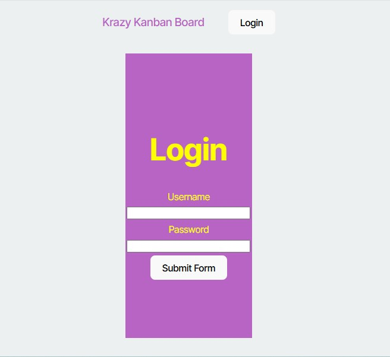

# Kanban-Board

  [](https://opensource.org/licenses/MIT)
  
  ## Table of Contents
  
  * [Description](#description)
  * [Installation](#installation)
  * [Usage](#usage)
  * [Contributing](#contributing)
  * [Test](#test)
  * [License](#license)
  * [Questions](#questions)
  
  ## Description
  This application enhances an already existing Kanban board and uses JSON Web Token (JWT) for authentication to the server API.

  ## Installation
  To successfully run this application, these are the following installation requirements: TypeScript, Node JS,`PostgreSQL`, `express`, `sequelize`, `jsonwebtoken`, `bcrypt`, `dotenv`, `react-router-dom`, and `npm` package. Additional tools you might need is `Insomnia` for API Testing.

  ## Usage 
  Here is an example screenshot and video of the Kanban-Board App:

  
  
  ## Contributing
  The source of contributors I have used in this application:
  * Stack Overlow
  * W3School Website
  * Dev Community Website
  * ChatGPT
  
  ## Test 
  Navigate to the filepath of where the code is saved. Before running the program, you must copy and paste the `.env.EXAMPLE` file with the code `DB_NAME='kanban_db'`,  `DB_USER=`, `DB_PASSWORD=`, and `JWT_SECRET_KEY=`. Then rename the file as`.env` in the server folder. Copy and paste the `.env.EXAMPLE` file in the client folder and rename the file as`.env`. In the `.env` content that's in the client folder, type the localhost URL `VITE_API_URL=`.
  
  Type the code below in the terminal, running each line of code separately.


  ```bash
  npm install

  ```

  Run the Application: 

  ``` bash 
  cd server
  npm run dev

  ``` 
  Open a new Terminal and navigate to project folder:

  ``` bash
  cd client 
  npm run dev

  ``` 

  ## License
  This project is Licensed under the MIT License.
  
  ## Questions
  Feel Free to contact me for any additional questions
  * GitHub: [jbarry89](https://github.com/jbarry89/)
  * Email: myEmail@gmail.com 
